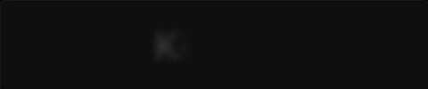
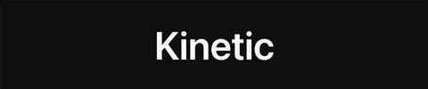
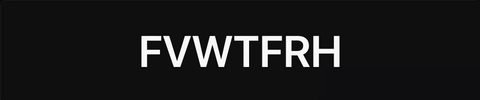
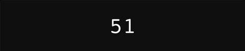
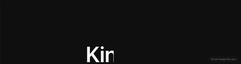
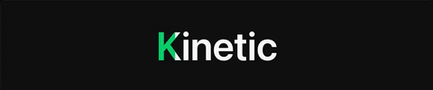
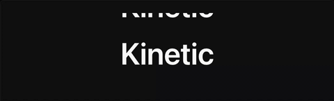

# Kinetic

**45 copy-paste text animations that run with zero dependencies — and tell you honestly when GSAP is worth it.**

**[Live demo →](https://aowshad.github.io/kinetic/)**

<table>
  <tr>
    <td width="50%"><br><sub><b>Blur In</b> · entrance</sub></td>
    <td width="50%"><br><sub><b>Letter Pop</b> · entrance</sub></td>
  </tr>
  <tr>
    <td><br><sub><b>Scramble</b> · kinetic</sub></td>
    <td><br><sub><b>Counter Roll</b> · kinetic</sub></td>
  </tr>
  <tr>
    <td><br><sub><b>Scroll Reveal Mask</b> · scroll</sub></td>
    <td><br><sub><b>Ink Fill</b> · hover</sub></td>
  </tr>
  <tr>
    <td><br><sub><b>Vertical Ticker</b> · loop</sub></td>
    <td><br><sub><b>Exit Scatter</b> · exit</sub></td>
  </tr>
</table>

<sub>All 45 recorded from the site itself — see [`docs/gifs/`](docs/gifs).</sub>

## Install

There is nothing to install. Open any animation on the
[live site](https://aowshad.github.io/kinetic/), copy the **JS** tab, and paste
it into a blank HTML file — no build step, no packages, no imports. The snippet
carries its own helpers inline.

To run the gallery locally:

```bash
npm install
npm run dev
```

```bash
npm run build    # production build to dist/, then pre-render every route
npm run gifs     # re-record docs/gifs/ from the running site
npm run og       # re-render the social preview cards in public/og/
```

## Categories

| Category | Trigger | Count |
|---|---|---|
| Entrance | plays once when scrolled into view | 12 |
| Kinetic | plays once, or loops in place | 10 |
| Scroll | scrubbed directly to scroll position | 7 |
| Hover | plays on pointer enter/focus | 8 |
| Loop | repeats forever | 5 |
| Exit | plays once, ending hidden | 3 |

## Why zero dependencies

GSAP core is ~25kb gzipped before a single plugin; the Web Animations API these
snippets run on ships in every browser at 0kb. All 45 animations run without
GSAP — 38 identically, and 7 scroll effects with a stated caveat on browsers
without [View Timeline](https://developer.mozilla.org/en-US/docs/Web/API/ViewTimeline)
support, where scrubbing falls back to an `IntersectionObserver` and gets
visibly coarser. Every card says which it is, and its code panel spells out
exactly what you give up.

Easing is the part people assume needs a library: every ease here — including
`elastic.out` and `bounce.out`, which have no single-curve CSS equivalent — is
pre-sampled into a CSS [`linear()`](https://developer.mozilla.org/en-US/docs/Web/CSS/easing-function/linear)
function and checked in as literals, so nothing calls into GSAP at runtime to
compute a curve. Text splitting uses a grapheme-aware `Intl.Segmenter` helper
rather than naive string spreading, so combining marks and family emoji survive.

## Stack

Vite + React + TypeScript, Tailwind v4, GSAP 3.15 (SplitText, ScrambleTextPlugin,
ScrollTrigger, TextPlugin, CustomEase — all free as of GSAP 3.13).

## Contributing

Adding an animation is one folder — see [CONTRIBUTING.md](CONTRIBUTING.md) for
the folder shape, the `AnimationModule` contract, the honesty rules behind the
`vanilla` tier, and how to record its gif.

## Deploy

Pushing to `main` runs [`.github/workflows/deploy.yml`](.github/workflows/deploy.yml),
which builds and publishes `dist/` to GitHub Pages. In the repo settings, set
**Settings → Pages → Source → GitHub Actions**. The site is served from
`/kinetic/` (see `base` in `vite.config.ts`) — if the repo is renamed, update
that value to match.

## License

[MIT](LICENSE) © 2026 Al Aowshad Himel
